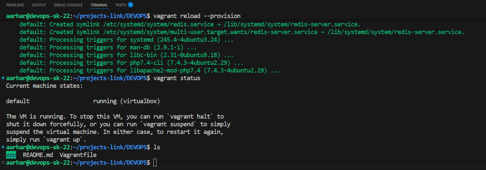
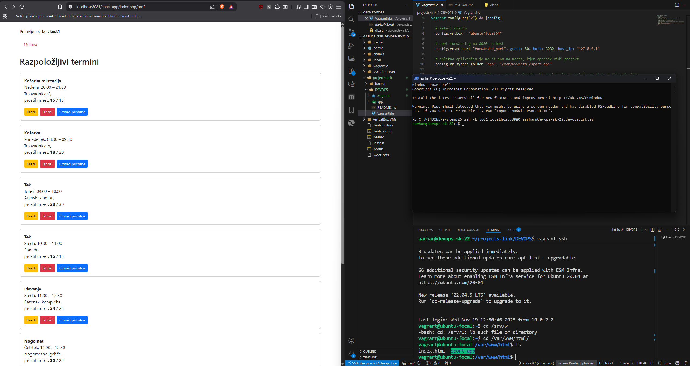
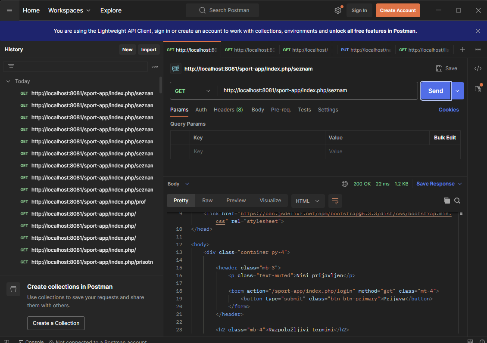

# README PROJEKT

## Opis projekta

Platforma omogoča prijavo in uporabo sistema za športne aktivnosti tako študentom kot profesorjem. Sistem ponuja:

* Registracijo in prijavo uporabnikov (študent, profesor, gost).
* Pregled športnih aktivnosti z omejenim številom mest.
* Prijavo študentov na aktivnosti (odbojka, košarka, tek v naravi, plavanje, pohodništvo, fitnes, funkcionalna vadba).
* Prikaz štetja udeležb za študenta.
* Kreiranje aktivnosti in označevanje prisotnosti s strani profesorjev.
* Gostje lahko vidijo samo aktivnosti in prosta mesta.

## Arhitektura projekta

Projekt uporablja štiri osnovne komponente:

1. **HTTP strežnik** – Apache2
2. **Aplikacija** – PHP brez framework-a
3. **SQL baza** – MySql
4. **Cache sistem** – Redis

## Verzija 1: Vagrant

* Namestitev Ubuntu/focal64
* Provisioning (apache2 mysql-server php libapache2-mod-php php-mysql redis-server php-redis)
* Samodejen deploy aplikacije

### Slike

## Verzija 2: cloud-init

Cloud-init je narejen na [vagrant_with_qemu](https://github.com/andraz87/DEVOPS/tree/vagrant_with_qemu) branch-u!
